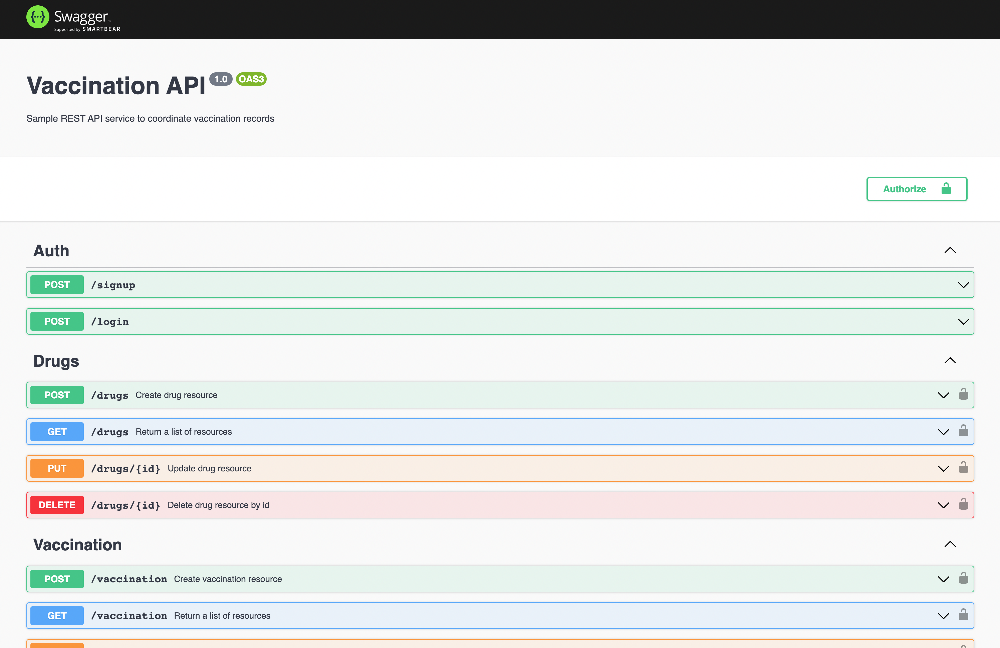
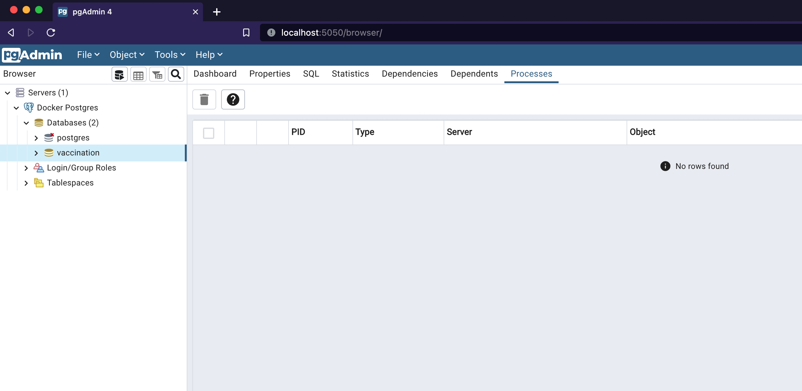
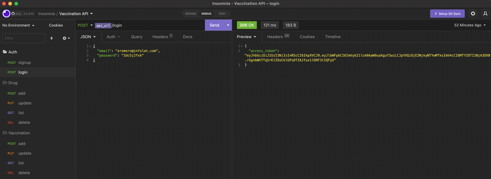

# Vaccination API 
Sample REST API service to coordinate vaccination records.

## Table of Content

- [Description](#description)
- [Technology Stack](#stack)
- [Local Installation](#installation)
- [Usage](#usage)
- [License](#license)

---
## Description

REST API  with **CRUD** functionality using `NestJS`, `CQRS` and `typeORM`.



---

## Technology Stack

The core technology stack in this project is based on NestJS framework.

- `node`: version 18.9.1
- `npm`: version 8.19.1
- `nestjs`: version 9.0.0


### Database Dependencies

- `pg`: PostgreSQL client for node.js.
- `@nestjs/typeorm`: Object Relational Mapper (ORM) available for TypeScript.


For the complete list of dependencies refer to `Package.json` file.

---
## Local Usage

In this section, you will see the tools required and steps to setup development environment for this project.


### **Installation**

Download the Installer: https://nodejs.org/en/download/

1. Verify the Node.js installation using terminal window and enter the following command: 

```bash
node --version
```

2. Clone the project repository 

```bash
git clone git@github.com:eromerodev/vaccination-api.git
```

4. Go into the project folder

```bash
cd vaccination-api
```

3. Install project dependencies

```bash
npm i
```

### Run Locally

#### Run Docker PostgreSQL

1. Inside this project go to the `docker/postgres` folder
2. Then run the following command: 

```bash
# make sure you are inside docker/postgres folder
$ docker-compose up --build
```

3. After the container is up and running you can visit http://localhost:5050 to login to pgAdmin.

#### pgAdmin Credentials
- `user`: pg@admin.com
- `pass`: admin

_NOTE: the docker-compose automatically will create the database schema using the the db.sql file_




#### Start the API

If the database is running you can start the project with the following command:

```bash
# development
$ npm run start:dev
```

### Test

```bash
# unit tests
$ npm run test

```
---

## Usage

The api is well document using the Swagger OpenAPI Specification.

http://localhost:3000/api

#### Insomnia

Also you can download an insomnia collection to import it into your local environment.

- [Insomnia collection](./docs/insomnia-vaccination-api.json)



---

## License
MIT

<hr />
<div align="center">
    <samp>Happy Hacking!😎</samp>
</div>